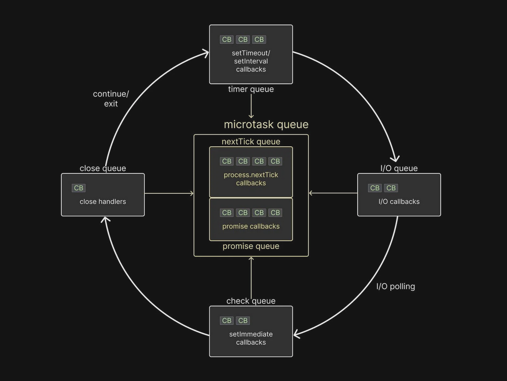

## Event loop visualization



## Exercise-1

```typescript
function exerciseOne() {
    Promise.resolve().then(() => {
        console.log("Promise.resolve task-1");
        process.nextTick(() => {
            console.log("Promise.resolve nextTick-1");
        });
        Promise.resolve().then(() => {
            console.log("Promise.resolve inside nextTick-1");
        });
        process.nextTick(() => {
            console.log("Promise.resolve nextTick-2");
        });
        Promise.resolve().then(() => {
            console.log("Promise.resolve inside nextTick-2");
        });
        process.nextTick(() => {
            console.log("Promise.resolve nextTick-3");
        });
        Promise.resolve().then(() => {
            console.log("Promise.resolve inside nextTick-3");
        });
    });
    
    process.nextTick(() => {
        console.log("nextTick task-1");        
    });
}

exerciseOne();
console.log('Log statement after exerciseOne');
console.log('Another log statement after exerciseOne');


Output: 
// Log statement after exerciseOne
// Another log statement after exerciseOne
// nextTick task-1
// Promise.resolve task-1
// Promise.resolve inside nextTick-1
// Promise.resolve inside nextTick-2
// Promise.resolve inside nextTick-3
// Promise.resolve nextTick-1
// Promise.resolve nextTick-2
// Promise.resolve nextTick-3
```

Learnings: 
1. All the synchronous tasks are executed before the asynchronous callbacks
2. In the micro-task queue, all the `process.nextTick` in the nextTick queue are executed before Promise.resolve in the Promise queue. 
3. Once the control is in Promise queue, all the promises are executed before the control moves to nextTick queue.

## Exercise-2

```typescript
function exerciseTwo() {
    Promise.resolve().then(() => {
        console.log("Promise");
    });
    
    process.nextTick(() => {        
        console.log("nextTick"); 
        Promise.resolve().then(() => console.log("Promise inside nextTick-1"));
        Promise.resolve().then(() => console.log("Promise inside nextTick-2"));
        Promise.resolve().then(() => console.log("Promise inside nextTick-3"));
        process.nextTick(() => console.log("nextTick inside nextTick-1"));
        process.nextTick(() => console.log("nextTick inside nextTick-2"));
        process.nextTick(() => console.log("nextTick inside nextTick-3"));
    });
}

exerciseTwo();

// nextTick
// nextTick inside nextTick-1
// nextTick inside nextTick-2
// nextTick inside nextTick-3
// Promise
// Promise inside nextTick-1
// Promise inside nextTick-2
// Promise inside nextTick-3
```
